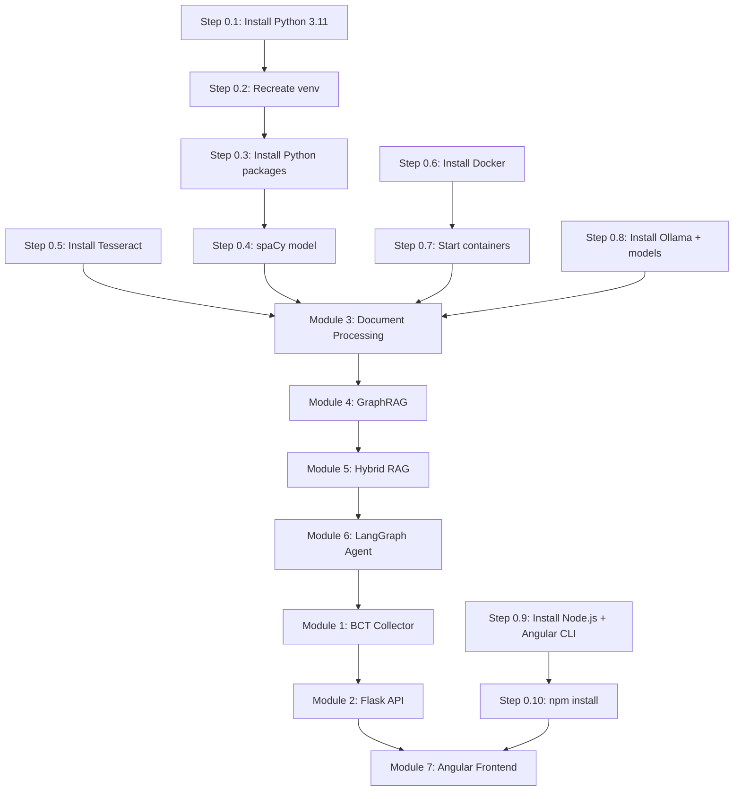

# KUSOR Project — Assessment & Detailed Plan

## 📊 Current State Assessment

### What EXISTS (Code)
The project structure is **fully scaffolded** with real implementations:

| Module | Files | Lines | Status |
|--------|-------|-------|--------|
| [document_processor.py](file:///home/houssein/kusor/backend/processing/document_processor.py) | 1 | 558 | ✅ Implemented |
| [neo4j_manager.py](file:///home/houssein/kusor/backend/graph/neo4j_manager.py) | 1 | 61 | ✅ Implemented |
| [graph_builder.py](file:///home/houssein/kusor/backend/graph/graph_builder.py) | 1 | 491 | ✅ Implemented |
| [cypher_queries.py](file:///home/houssein/kusor/backend/graph/cypher_queries.py) | 1 | 135 | ✅ Implemented |
| [hybrid_retriever.py](file:///home/houssein/kusor/backend/retrieval/hybrid_retriever.py) | 1 | 125 | ✅ Implemented |
| [agent_graph.py](file:///home/houssein/kusor/backend/agent/agent_graph.py) | 1 | 316 | ✅ Implemented |
| [app.py](file:///home/houssein/kusor/backend/app.py) | 1 | 173 | ✅ Implemented |
| All routes (6 files) | 6 | — | ✅ Scaffolded |
| All models (5 files) | 5 | — | ✅ Scaffolded |
| Frontend Angular (24 .ts files) | 24 | — | ✅ Scaffolded |

### What's BROKEN / MISSING (Infrastructure)

> [!CAUTION]
> **The entire runtime environment is non-functional.** Nothing can be tested or run until these are fixed.

| Component | Expected | Actual | Severity |
|-----------|----------|--------|----------|
| **Python venv** | Python 3.11+ with all packages | Venv created for 3.12 but system only has 3.10; `pip` is broken; no packages importable | 🔴 Critical |
| **Docker** | Docker + Docker Compose | Not installed at all | 🔴 Critical |
| **Ollama** | Running with `qwen2.5:7b` + `nomic-embed-text` | Not installed | 🔴 Critical |
| **Node.js / npm** | Node 20 via nvm | Not installed (no nvm, no node, no npm) | 🔴 Critical |
| **Angular CLI** | `ng` globally installed | Not installed | 🔴 Critical |
| **Tesseract OCR** | `tesseract-ocr` + `tesseract-ocr-fra` | Not installed | 🟡 Medium |
| **spaCy model** | `fr_core_news_lg` | Not installed (spaCy itself not importable) | 🟡 Medium |
| **NVIDIA drivers** | `nvidia-smi` working | Not in PATH or not installed | 🟡 Medium |
| **sudo access** | Password-less sudo | Requires password | 🟠 Needs user |

### OS Details
- **OS**: Ubuntu 22.04.5 LTS (Jammy) on Dell G15-5530
- **GPU**: NVIDIA RTX 4060 8GB VRAM (per spec, but `nvidia-smi` not found)
- **System Python**: 3.10.12 (need 3.11+)
- **Has**: `curl`, `wget`, `apt-get`

---

## 🔧 Phase 0 — Infrastructure Setup (Must Do First)

> [!IMPORTANT]
> All of these steps require `sudo` access. The user must provide their password or run these commands manually.

### Step 0.1 — Install Python 3.11+
```bash
sudo add-apt-repository ppa:deadsnakes/ppa -y
sudo apt-get update
sudo apt-get install -y python3.11 python3.11-venv python3.11-dev
```

### Step 0.2 — Recreate Python Virtual Environment
```bash
cd ~/kusor
rm -rf backend/.venv
python3.11 -m venv backend/.venv
source backend/.venv/bin/activate
pip install --upgrade pip setuptools wheel
```

### Step 0.3 — Install All Python Packages
```bash
source backend/.venv/bin/activate
pip install \
  flask==3.1.3 flask-restx==1.3.2 Flask-JWT-Extended==4.7.4 flask-cors==6.0.5 \
  flask-migrate \
  SQLAlchemy==2.0.51 alembic==1.18.5 psycopg2-binary==2.9.12 \
  neo4j==6.2.0 chromadb==1.5.9 \
  langchain==1.3.13 langchain-chroma==1.1.0 langchain-ollama==1.1.0 \
  langchain-community==0.4.2 langchain-text-splitters==1.1.2 \
  langchain-experimental \
  langgraph==1.2.9 langgraph-prebuilt==1.1.0 \
  instructor==1.15.4 pydantic==2.13.4 \
  pymupdf==1.28.0 pytesseract==0.3.13 \
  rank-bm25==0.2.2 sentence-transformers==5.6.0 \
  beautifulsoup4==4.15.0 requests==2.34.2 APScheduler==3.11.3 \
  bcrypt==5.0.0 python-dotenv==1.2.2 \
  torch==2.13.0 transformers==5.13.0 \
  ollama==0.6.2 pytest==9.1.1 \
  spacy
```

### Step 0.4 — Install spaCy French Model
```bash
source backend/.venv/bin/activate
python -m spacy download fr_core_news_lg
```

### Step 0.5 — Install Tesseract OCR
```bash
sudo apt-get install -y tesseract-ocr tesseract-ocr-fra
```

### Step 0.6 — Install Docker
```bash
# Install Docker Engine
curl -fsSL https://get.docker.com -o get-docker.sh
sudo sh get-docker.sh
sudo usermod -aG docker $USER
# Log out and back in for group change to take effect, OR:
newgrp docker
```

### Step 0.7 — Start Docker Services
```bash
cd ~/kusor/docker
docker compose up -d
# Verify all 3 containers are running:
docker compose ps
# Expected: kusor_neo4j, kusor_chroma, kusor_postgres all "Up"
```

### Step 0.8 — Install Ollama + Pull Models
```bash
curl -fsSL https://ollama.com/install.sh | sh
ollama serve &  # Start Ollama daemon (or it may auto-start)
ollama pull qwen2.5:7b
ollama pull nomic-embed-text
# Verify:
curl http://localhost:11434/api/tags
```

### Step 0.9 — Install Node.js 20 + Angular CLI
```bash
curl -o- https://raw.githubusercontent.com/nvm-sh/nvm/v0.40.3/install.sh | bash
source ~/.nvm/nvm.sh
nvm install 20
nvm use 20
npm install -g @angular/cli
```

### Step 0.10 — Install Frontend Dependencies
```bash
cd ~/kusor/frontend/kusor-ui
npm install
```

### Step 0.11 — Verify NVIDIA Drivers
```bash
nvidia-smi
# If not working, install drivers:
# sudo apt-get install -y nvidia-driver-535
```

### Step 0.12 — Generate Proper Secret Keys
```bash
cd ~/kusor/backend
# Generate real secret keys for .env
python3.11 -c "import secrets; print('SECRET_KEY=' + secrets.token_hex(32))"
python3.11 -c "import secrets; print('JWT_SECRET_KEY=' + secrets.token_hex(32))"
# Update .env with the generated keys
```

### Step 0.13 — Create Data Directories
```bash
mkdir -p ~/kusor/backend/data/circulars
```

---

## ✅ Phase 0 Verification Checklist

After completing all steps, verify:

```bash
# Python venv
source ~/kusor/backend/.venv/bin/activate
python --version  # Should be 3.11.x
python -c "import flask, langchain, chromadb, neo4j, torch, spacy; print('All packages OK')"
python -c "import spacy; nlp = spacy.load('fr_core_news_lg'); print('spaCy model OK')"

# Docker services
docker compose -f ~/kusor/docker/docker-compose.yml ps  # All 3 Up

# Ollama
curl -s http://localhost:11434/api/tags | python3 -m json.tool  # qwen2.5:7b + nomic-embed-text

# Node.js
node --version   # v20.x
ng version       # Angular CLI 21.x

# Tesseract
tesseract --version  # tesseract 4.x or 5.x

# GPU
nvidia-smi  # RTX 4060 visible
```

---

## 🏗️ Phase 1 — Module Build Order

> [!NOTE]
> The code is already written. Phase 1 is about **testing, debugging, and making it all work together**. The build order follows the dependency chain specified in [CLAUDE.md](file:///home/houssein/kusor/CLAUDE.md).

### Module 3 — Document Processing Pipeline
**Priority**: 🥇 First — everything depends on it
**Files**: [document_processor.py](file:///home/houssein/kusor/backend/processing/document_processor.py)
**Test**:
```bash
python -m pytest backend/processing/tests/test_document_processor.py -v
```
**Tasks**:
- [ ] Verify DocumentProcessor initializes with all services connected
- [ ] Test PDF text extraction (PyMuPDF + OCR fallback)
- [ ] Test structural pre-segmentation (Article/Titre/Chapitre/Section boundaries)
- [ ] Test semantic chunking with nomic-embed-text
- [ ] Test ChromaDB storage with all 5 metadata fields
- [ ] Test BM25 index creation and persistence
- [ ] Test NER extraction (spaCy + regex)
- [ ] Test idempotent reprocessing

### Module 4 — GraphRAG Knowledge Graph
**Priority**: 🥈 Second
**Files**: [neo4j_manager.py](file:///home/houssein/kusor/backend/graph/neo4j_manager.py), [graph_builder.py](file:///home/houssein/kusor/backend/graph/graph_builder.py), [cypher_queries.py](file:///home/houssein/kusor/backend/graph/cypher_queries.py)
**Test**:
```bash
python -m pytest backend/graph/tests/test_graph_builder.py -v
```
**Tasks**:
- [ ] Verify Neo4j connection and health check
- [ ] Create Neo4j indexes/constraints (from §7 of CLAUDE.md)
- [ ] Test Circular node creation (MERGE idempotency)
- [ ] Test Entity node creation (no duplicates)
- [ ] Test regex relationship extraction (ABROGATES, MODIFIES, REFERENCES, COMPLEMENTS)
- [ ] Test LLM relationship extraction via Instructor + Pydantic
- [ ] Test 2-hop traversal
- [ ] Test subgraph export for visualization

### Module 5 — Hybrid RAG Search Engine
**Priority**: 🥉 Third
**Files**: [vector_searcher.py](file:///home/houssein/kusor/backend/retrieval/vector_searcher.py), [bm25_searcher.py](file:///home/houssein/kusor/backend/retrieval/bm25_searcher.py), [graph_searcher.py](file:///home/houssein/kusor/backend/retrieval/graph_searcher.py), [reranker.py](file:///home/houssein/kusor/backend/retrieval/reranker.py), [hybrid_retriever.py](file:///home/houssein/kusor/backend/retrieval/hybrid_retriever.py)
**Test**:
```bash
python -m pytest backend/retrieval/tests/test_hybrid_retriever.py -v
```
**Tasks**:
- [ ] Test VectorSearcher with ChromaDB
- [ ] Test BM25Searcher with persisted index
- [ ] Test GraphSearcher (entity extraction → Neo4j → ChromaDB)
- [ ] Test RRF fusion formula
- [ ] Test CrossEncoderReranker (ms-marco-MiniLM-L-6-v2)
- [ ] Test full hybrid pipeline end-to-end

### Module 6 — LangGraph AI Agent
**Priority**: 4th
**Files**: [agent_graph.py](file:///home/houssein/kusor/backend/agent/agent_graph.py), [schemas.py](file:///home/houssein/kusor/backend/agent/schemas.py), [prompts.py](file:///home/houssein/kusor/backend/agent/prompts.py), [tools.py](file:///home/houssein/kusor/backend/agent/tools.py)
**Test**:
```bash
python -m pytest backend/agent/tests/test_agent.py -v
```
**Tasks**:
- [ ] Test question classification (factual/relational/temporal/comparative)
- [ ] Test tool selection strategy mapping
- [ ] Test answer generation with Qwen2.5-7B
- [ ] Test Instructor + Pydantic output enforcement
- [ ] Test retry on malformed JSON
- [ ] Test AgentResponse schema compliance

### Module 1 — BCT Circular Collector
**Priority**: 5th
**Files**: [bct_scraper.py](file:///home/houssein/kusor/backend/collector/bct_scraper.py), [scheduler.py](file:///home/houssein/kusor/backend/collector/scheduler.py)
**Test**:
```bash
python -m pytest backend/collector/tests/test_bct_scraper.py -v
```
**Tasks**:
- [ ] Test BCT page parsing (with mocked HTTP)
- [ ] Test duplicate detection
- [ ] Test PDF download
- [ ] Test full ingestion pipeline
- [ ] Test APScheduler integration

### Module 2 — Flask REST API
**Priority**: 6th
**Files**: [app.py](file:///home/houssein/kusor/backend/app.py), all [routes/](file:///home/houssein/kusor/backend/routes), [models/](file:///home/houssein/kusor/backend/models), [middleware/](file:///home/houssein/kusor/backend/middleware)
**Tasks**:
- [ ] Run Alembic migrations (`flask db init`, `flask db migrate`, `flask db upgrade`)
- [ ] Create initial admin user
- [ ] Test all API endpoints via Swagger UI at `/api/docs`
- [ ] Test JWT authentication flow
- [ ] Test CORS with Angular dev server

### Module 7 — Angular Frontend
**Priority**: 7th (Last)
**Files**: All under [frontend/kusor-ui/src/app/](file:///home/houssein/kusor/frontend/kusor-ui/src/app)
**Tasks**:
- [ ] Verify all components compile (`npm run build`)
- [ ] Test login flow
- [ ] Test dashboard with live stats
- [ ] Test chat interface with markdown rendering
- [ ] Test graph visualization (ngx-graph)
- [ ] Test document management (upload, list, reindex)
- [ ] Apply dark theme, glassmorphism, animations

---

## 📋 Summary — What to Do Right Now



> [!WARNING]
> **The immediate blocker is infrastructure.** The existing code cannot be imported, tested, or run until Python 3.11, Docker, Ollama, and Node.js are installed. Steps 0.1–0.10 must be completed before any development work can begin.

**Estimated time**: 
- Phase 0 (Infrastructure): ~30-45 minutes (depending on download speeds)
- Phase 1 (Module testing & debugging): ~2-4 hours per module
