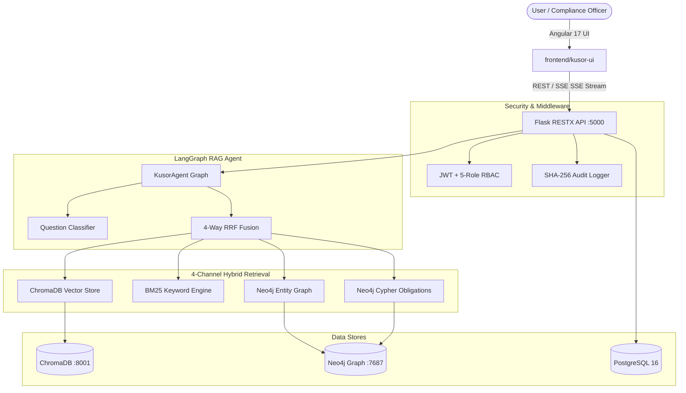

# KUSOR v3 — AI Compliance & Regulatory Intelligence Platform


**KUSOR v3** is an enterprise-grade AI Compliance & Regulatory Intelligence platform tailored for **Attijari Bank Tunisia**. It processes Central Bank of Tunisia (**BCT**) circulars, automates regulatory obligation extractions, models temporal graph relationships in **Neo4j**, executes 4-channel hybrid retrieval, and presents a pitch-black (`#000000`) glassmorphic UI built with **Angular 17+**.

---

## 🌟 Key Capabilities

### 1. Multi-Agent RAG Orchestration (LangGraph)
- **State Graph Pipeline**: 7-node LangGraph execution flow (`classify_question` $\rightarrow$ `resolve_point_in_time` $\rightarrow$ `recall_past_facts` $\rightarrow$ `parallel_retrieve` $\rightarrow$ `generate_answer` $\rightarrow$ `compute_confidence` $\rightarrow$ `persist_fact_memory`).
- **5-Signal Confidence Score**: Calculates mathematically weighted confidence based on top norm score, unique source coverage, channel diversity, candidate count, and graph traversal.

### 2. 4-Channel Hybrid Retrieval Engine
- **Vector Search**: ChromaDB semantic embeddings (`nomic-embed-text`).
- **Keyword Search**: In-memory BM25 rank matching (`rank_bm25`).
- **Entity & Temporal Graph Search**: Cypher queries traversing Neo4j nodes with point-in-time temporal filtering (`valid_from` / `valid_until`).
- **Direct Obligation Search**: Structured Cypher lookup over (`:Obligation`) nodes (`PROHIBITION`, `REQUIREMENT`, `THRESHOLD`, `DEADLINE`).
- **4-Way RRF Fusion**: Reciprocal Rank Fusion ($k=60$) dynamically re-weighted by question classification (`factual`, `relational`, `temporal`, `comparative`, `propagation`, `point_in_time`).

### 3. Specialized Banking Compliance Modules
- **KYC / AML Screening**: Automated customer screening against sanctions lists and BCT regulatory circulars.
- **Credit Supervision Pre-Screening**: Evaluates credit applications against BCT debt ratio thresholds and guarantee requirements.
- **Contract BCT Compliance Analysis**: Analyzes contract templates for non-compliant or obsolete clauses.
- **Change Propagation Cartography**: Maps downstream impacts of new BCT circulars onto bank processes and contract templates.

### 4. Interactive 2D Visual Neo4j Graph Canvas
- **Vis.js Physics Network**: Real-time interactive 2D node-edge canvas on `/graph`.
- **Color-Coded Spheres**:
  - 🟠 **Circular** (`#E85D04`)
  - 🔴 **Obligation** (`#DC2F02`)
  - 🟢 **Process** (`#10B981`)
  - 🟣 **ContractTemplate** (`#818CF8`)
- **Inspector Drawer**: Click any node to view exact metadata properties in real time.

### 5. High-Impact Pitch-Black UI Design System
- **Pure `#000000` Canvas**: Zero blueish hue with glowing `#E85D04` sunset fire accents.
- **Independent Full-Screen Login**: Dedicated authentication portal with Attijari Bank branding, live node status indicator, and quick demo role presets.

---

## 🏗 System Architecture



---

## 🚀 Quick Start Guide

### Prerequisites
- **Python**: `3.11+`
- **Node.js**: `18.x+` & `npm`
- **Databases**:
  - PostgreSQL 16+ running on `localhost:5432` (`kusor_db`)
  - Neo4j Graph Database running on `localhost:7687` (`bolt://localhost:7687`)
  - ChromaDB running on `localhost:8001`
- **Ollama**: Local Ollama server running `qwen2.5:7b` & `nomic-embed-text` on `http://localhost:11434`

---

### 1. Backend Setup

```bash
# Clone repository
git clone https://github.com/HousseinTlili/Kusor-V2.git
cd Kusor-V2

# Create Python virtual environment
python3 -m venv backend/.venv
source backend/.venv/bin/activate

# Install dependencies
pip install -r backend/requirements.txt

# Configure environment variables
cp .env.example .env

# Initialize database schema
PYTHONPATH=. python backend/scripts/init_db.py

# Launch Flask REST API server (Port 5000)
PYTHONPATH=. python backend/app.py
```

Swagger API documentation will be available at: **`http://localhost:5000/api/docs`**

---

### 2. Frontend Setup

```bash
# Navigate to Angular frontend
cd frontend/kusor-ui

# Install dependencies
npm install

# Start Angular development server (Port 4200)
npm start
```

Open your browser at: **`http://localhost:4200`**

---

## 🔑 Default Credentials

| Role | Username | Password | Access Level |
| :--- | :--- | :--- | :--- |
| **Administrator** | `admin` | `Admin123!` | Full system access, document ingestion, audit logs |
| **Compliance Officer** | `compliance_user` | `User123!` | KYC, Chat, Contract Analysis, Impact Viewer |

---

## 📁 Repository Structure

```
Kusor-V2/
├── backend/
│   ├── agent/                 # LangGraph RAG Agent & Prompts
│   ├── collector/             # BCT Web Scraper & Batch Ingestor
│   ├── graph/                 # Neo4j & Graphiti Memory Managers
│   ├── middleware/            # RBAC Auth & SHA-256 Audit Middleware
│   ├── models/                # SQLAlchemy Models (User, Document, Chunk, AuditLog)
│   ├── processing/            # Document Processor & 2-Pass Obligation Extractor
│   ├── retrieval/             # 4-Channel Hybrid Retriever & RRF Fusion Engine
│   ├── routes/                # Flask-RESTX OpenAPI Controllers (10 Namespaces)
│   ├── app.py                 # Flask Application Factory
│   └── requirements.txt       # Backend Python Dependencies
├── frontend/
│   └── kusor-ui/              # Angular 17 Standalone Application
│       ├── src/
│       │   ├── app/
│       │   │   ├── core/      # Guards, Interceptors, & Services
│       │   │   ├── pages/     # Standalone Page Components (Chat, Graph, KYC, etc.)
│       │   │   └── shared/    # Sidebar & Common UI Components
│       │   └── styles.css     # Pitch-Black (#000000) & Sunset Fire (#E85D04) Theme
│       └── package.json       # Frontend Node Dependencies
├── docs/                      # Architectural Specification Docs
├── README.md                  # Project Documentation
└── .gitignore                 # Root Repository Ignore File
```

---

## 🛡 License & Ownership

Developed for **Attijari Bank Tunisia** — All Rights Reserved © 2026.
