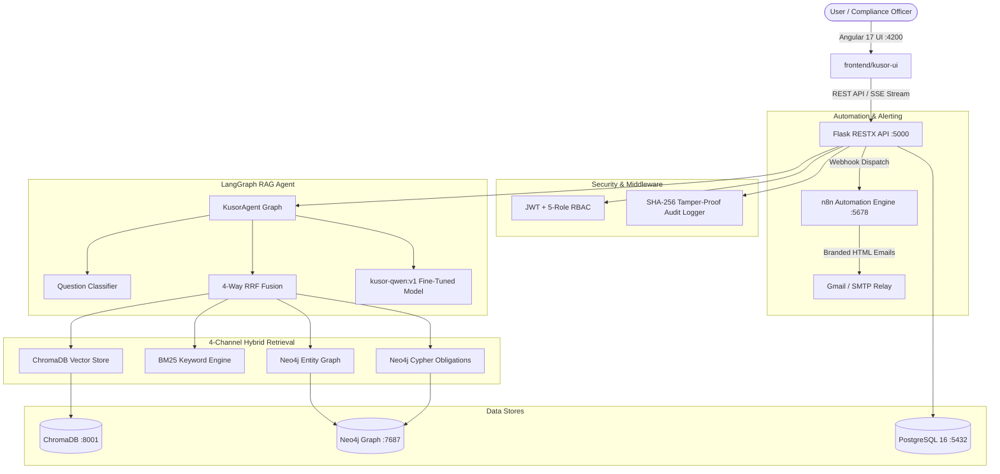

# KUSOR v3 — AI Compliance & Regulatory Intelligence Platform


-10B981?style=for-the-badge)


**KUSOR v3** is an enterprise-grade AI Compliance & Regulatory Intelligence platform tailored for **Attijari Bank Tunisia**. It continuously ingests Central Bank of Tunisia (**BCT**) circulars, extracts legal obligations with French NLP (`spaCy fr_core_news_lg`), models temporal graph relationships in **Neo4j**, executes 4-channel hybrid retrieval, and runs fine-tuned BCT reasoning via `kusor-qwen:v1` inside a pitch-black (`#000000`) glassmorphic UI built with **Angular 17+**.

---

## 🌟 Key Capabilities

### 1. Multi-Agent RAG Orchestration (LangGraph)
- **7-Node State Graph Flow**: `classify_question` $\rightarrow$ `resolve_point_in_time` $\rightarrow$ `recall_past_facts` $\rightarrow$ `parallel_retrieve` $\rightarrow$ `generate_answer` $\rightarrow$ `compute_confidence` $\rightarrow$ `persist_fact_memory`.
- **5-Signal Confidence Score**: Calculates mathematically weighted confidence based on top norm score, unique source coverage, channel diversity, candidate count, and graph traversal.

### 2. 4-Channel Hybrid Retrieval Engine
- **Vector Search**: ChromaDB semantic embeddings (`nomic-embed-text`).
- **Keyword Search**: In-memory BM25 rank matching (`rank_bm25`).
- **Entity & Temporal Graph Search**: Cypher queries traversing Neo4j nodes with point-in-time temporal filtering (`valid_from` / `valid_until`).
- **Direct Obligation Search**: Structured Cypher lookup over (`:Obligation`) nodes (`PROHIBITION`, `REQUIREMENT`, `THRESHOLD`, `DEADLINE`).
- **4-Way RRF Fusion**: Reciprocal Rank Fusion ($k=60$) dynamically weighted by question classification.

### 3. Fine-Tuned BCT Language Model (`kusor-qwen:v1`)
- **QLoRA Fine-Tuned**: Trained on 503 French BCT regulatory questions and answers with **97.96% validation token accuracy**.
- **Quantization & Acceleration**: Packaged in Ollama (Q4_K_M) with real-time GPU inference (~80 tokens/sec).
- **Exact Legal Citations**: Cites BCT circular numbers and exact prudential ratios (e.g. 40% maximum debt ratio, 10% CAR, 100% LCR).

### 4. Specialized Banking Modules (5 Role Dashboards)
- **💳 Credit Supervision Pre-Screening (`/credit`)**: Evaluates loan files against BCT debt ratio thresholds and guarantee requirements.
- **⚖️ Contract Compliance Checker (`/contract`)**: Analyzes contract templates for non-compliant or obsolete clauses.
- **🔍 KYC / AML Screening (`/kyc`)**: Automated screening of customers and PEPs (Politically Exposed Persons) against UN/GAFI sanctions lists.
- **🗺️ Circular Impact & Change Propagation (`/impact-viewer`)**: Maps downstream impacts of new circulars across bank departments.
- **🕸️ Interactive 2D Neo4j Visual Graph (`/graph`)**: Real-time interactive Vis.js node-edge canvas with live property inspector.

### 5. Automated n8n Workflow Engine
- **Weekly Digest**: Scheduled summary sent to compliance executives.
- **Instant Impact Alert**: Real-time webhook notifications dispatched when high/critical circulars are published.
- **Daily FATF & Sanctions Sync**: Daily synchronization against international watchlists.

---

## 🏗 System Architecture



---

## 🚀 Quick Start Guide

### Prerequisites
- **Linux / WSL2** with **Docker & Docker Compose**
- **NVIDIA GPU** (RTX 3060/4060 or higher recommended) with NVIDIA Container Toolkit
- **Python**: `3.11+`
- **Node.js**: `18.x+` & `npm`
- **Ollama**: Local Ollama runtime with `kusor-qwen:v1` and `nomic-embed-text`

---

### One-Command Startup

Start the entire platform (Docker infrastructure, Flask backend, Angular frontend, n8n):

```bash
./start.sh
```

To gracefully stop all background services:
```bash
./stop.sh
```

---

### 🌐 Access URLs

| Service | URL | Description |
| :--- | :--- | :--- |
| **KUSOR Web App** | **`http://localhost:4200`** | Main compliance platform with 5 role dashboards |
| **Backend API & Swagger** | **`http://localhost:5000/api/docs`** | Flask REST API with OpenAPI specifications |
| **n8n Automation Engine** | **`http://localhost:5678`** | Workflow automations & webhook triggers |
| **Neo4j Browser** | **`http://localhost:7474`** | Interactive Cypher graph database console |

---

## 🔑 Demo Login Credentials

All demo accounts use the standard password: **`Password123!`**

| Role | Username | Access Scope |
| :--- | :--- | :--- |
| **1. Executive / Admin** | `admin` | Full system access, audit logs, document ingestion, sync |
| **2. Compliance Officer** | `compliance` | KYC/AML screening, Circular Impact Viewer, RAG Chat |
| **3. Legal Counsel** | `legal` | Contract Compliance Checker, Knowledge Graph, Obligations |
| **4. Credit Risk Analyst** | `credit` | Credit Application Pre-Screening, BCT Debt Ratios |
| **5. Standard User** | `user` | Regulatory Search & Compliance Q&A Assistant |

---

## 📁 Repository Structure

```
Kusor-V2/
├── backend/
│   ├── agent/                 # LangGraph Agent, Sub-Agents (Credit, KYC, Contract, Impact)
│   ├── collector/             # Multi-Source Regulatory Scrapers (BCT, FATF)
│   ├── graph/                 # Neo4j & Graphiti Temporal Memory Managers
│   ├── middleware/            # RBAC Auth & SHA-256 Audit Logger
│   ├── models/                # SQLAlchemy ORM Models (User, Document, Chunk, AuditLog)
│   ├── processing/            # Document Processor & 2-Pass French NLP Extractor
│   ├── retrieval/             # 4-Channel Hybrid Retriever & RRF Fusion
│   ├── routes/                # Flask-RESTX OpenAPI Namespaces
│   ├── app.py                 # Flask Application Entrypoint
│   └── requirements.txt       # Python Dependencies
├── frontend/
│   └── kusor-ui/              # Angular 17 Standalone Application
│       ├── src/app/
│       │   ├── core/          # Services, Guards, Interceptors
│       │   ├── pages/         # 5 Role Pages (Chat, Credit, Contract, KYC, Graph, Admin)
│       │   └── shared/        # Reusable UI Components
│       └── package.json       # Frontend Dependencies
├── n8n/
│   └── workflows/             # n8n Automated Workflow JSON Templates
├── training/
│   ├── data/                  # 500+ French Regulatory Q&A Dataset
│   ├── train_qlora.py         # GPU QLoRA Fine-Tuning Script
│   └── Modelfile              # Ollama Model Definition
├── docker-compose.yml         # Container Stack (PostgreSQL, Neo4j, ChromaDB, n8n)
├── start.sh                   # One-Click Platform Launcher
├── stop.sh                    # Graceful Platform Teardown
├── README.md                  # Project Documentation
└── .gitignore                 # Clean Git Tracking Configuration
```

---

## 🛡 License & Ownership

Developed for **Attijari Bank Tunisia** — All Rights Reserved © 2026.
