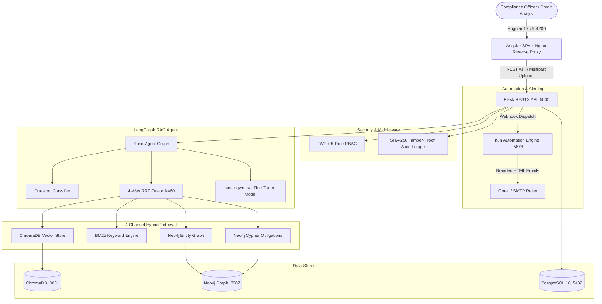

# KUSOR v3 — AI Compliance & Regulatory Intelligence Platform
## Multi-Agent Architecture, Temporal Graph RAG & Automated Multi-PDF Compliance for Attijari Bank Tunisia

---


-10B981?style=for-the-badge)


**KUSOR v3** is an enterprise-grade AI Compliance & Regulatory Intelligence platform engineered for **Attijari Bank Tunisia** and the **Banque Centrale de Tunisie (BCT)** prudential framework. It continuously ingests BCT circulars, extracts legal obligations with French NLP (`spaCy fr_core_news_lg`), models temporal graph relationships in **Neo4j**, executes 4-channel hybrid retrieval, and runs fine-tuned BCT reasoning via `kusor-qwen:v1` inside an Angular 17 interface featuring dedicated document upload slots and 100% offline capability.

---

## 🌟 Key Capabilities & Technical Features

### 1. Multi-Agent RAG Orchestration (LangGraph)
- **7-Node State Graph Flow**: `classify_question` $\rightarrow$ `resolve_point_in_time` $\rightarrow$ `recall_past_facts` $\rightarrow$ `parallel_retrieve` $\rightarrow$ `generate_answer` $\rightarrow$ `compute_confidence` $\rightarrow$ `persist_fact_memory`.
- **5-Signal Confidence Score**: Calculates mathematically weighted confidence based on top norm score, unique source coverage, channel diversity, candidate count, and graph traversal.

### 2. 4-Channel Hybrid Retrieval Engine (RRF $k=60$)
- **Vector Search**: ChromaDB semantic embeddings (`nomic-embed-text`).
- **Keyword Search**: In-memory BM25 rank matching (`rank_bm25`).
- **Entity & Temporal Graph Search**: Cypher queries traversing Neo4j nodes with point-in-time temporal filtering (`valid_from` / `valid_until`).
- **Direct Obligation Search**: Structured Cypher lookup over (`:Obligation`) nodes (`PROHIBITION`, `REQUIREMENT`, `THRESHOLD`, `DEADLINE`).
- **Dynamic RRF Fusion**: Reciprocal Rank Fusion ($k=60$) dynamically weighted by question classification.

### 3. Fine-Tuned BCT Language Model (`kusor-qwen:v1`)
- **QLoRA Fine-Tuned**: Trained on 503 French BCT regulatory questions and answers with **97.96% validation token accuracy**.
- **Quantization & Acceleration**: Packaged in Ollama (Q4_K_M) with real-time GPU inference (~80 tokens/sec).
- **Exact Legal Citations**: Cites BCT circular numbers and exact prudential ratios (e.g. 40% maximum debt ratio, 10% CAR, 100% LCR) with zero hallucination.

### 4. Multi-File PDF Extraction & Processing Layer
- **Dual-Engine Parser**: High-speed PyMuPDF structural vector extraction with automatic **Tesseract OCR (French & Arabic)** fallback.
- **Dedicated Upload Slots**: Clear, labeled input slots for CIN, Pay Slips, Electricity/STEG Bills, Property Appraisals, Compromis, and Contracts with live visual validation (`✓ Fichier validé`).
- **Horizontal Top-to-Bottom Layout**: Upper parameters and file slots with full-width analytics underneath.

### 5. Specialized Banking Compliance Modules
- **🔍 KYC / AML Screening (`/kyc`)**: Customer due diligence (Circulaire 2018-09), PEP detection, and fuzzy cross-matching against CTAF, OFAC, and UN sanctions watchlists.
- **💳 Credit Supervision Pre-Screening (`/credit`)**: 3-agent system (Completeness, Identity Cross-Reference, and Numerical Financial Sub-Agent computing exact annuities and checking the **BCT 40% debt ceiling**).
- **⚖️ Contract Risk & Legal Audit (`/contract`)**: Automatic clause segmentation, unfair penalty/usury detection, and Neo4j temporal validity checking.
- **🗺️ Circular Impact & Change Propagation (`/impact-viewer`)**: Downstream impact mapping across bank business units.
- **🕸️ Interactive 2D Neo4j Knowledge Graph (`/graph`)**: Live Vis.js graph visualizer with preset domain filters, hierarchical tree mode, instant keyword search, and node inspector drawer.

---

## 🏗 System Architecture



---

## 🚀 Quick Start Guide

### Option 1: All-in-One Local Offline Execution (Recommended for Demo)
Everything runs locally on your machine with **zero internet required**:

```bash
cd /home/houssein/kusor-v3
./start.sh
```

To stop all services:
```bash
./stop.sh
```

---

### Option 2: Single-Command Production Docker Deployment
Both frontend (via Nginx Alpine) and backend (via Gunicorn) are containerized:

```bash
cd /home/houssein/kusor-v3
docker compose up -d --build
```

---

## 🌐 Access Endpoints

| Service | Local URL | Description |
| :--- | :--- | :--- |
| **KUSOR Web App** | **`http://localhost:4200`** | Main banking compliance platform (Light/Dark themes) |
| **Login Screen** | **`http://localhost:4200/login`** | Split-screen login with 1-click preset account buttons |
| **KYC / AML Module** | **`http://localhost:4200/kyc`** | Dedicated 4-slot customer due diligence audit |
| **Credit Pre-Screening** | **`http://localhost:4200/credit`** | Multi-agent loan pre-screening & 40% BCT ratio |
| **Contract Risk Analyzer**| **`http://localhost:4200/contract`** | Clause segmentation & BCT legal conformity |
| **Neo4j Knowledge Graph**| **`http://localhost:4200/graph`** | Interactive visual regulatory graph |
| **Backend REST API & Docs**| **`http://localhost:5000/api/docs`** | Flask-RESTX Swagger OpenAPI specifications |
| **n8n Automation Engine** | **`http://localhost:5678`** | Automated workflow triggers & email alerting |

---

## 🔑 Demo Login Credentials

You can click any of the **1-Click Quick Fill Buttons** on the login page or enter credentials manually:

| Persona | Username | Password | Access Scope |
| :--- | :--- | :--- | :--- |
| **👑 Administrateur** | `admin` | `Admin123!` | Full system admin, sync, and audit logs |
| **🛡️ Officier Conformité**| `compliance_user`| `User123!` | KYC/AML, Sanctions, Impact Viewer |
| **💳 Analyste Crédit** | `credit_officer` | `User123!` | Credit Application Pre-Screening |
| **⚖️ Conseiller Juridique**| `legal_advisor` | `User123!` | Contract Compliance & Graph Analysis |

---

## 📚 Technical Documentation & PDF Reports

The repository includes publication-quality reports and academic whitepapers:

| Document | File Path | Format & Scope |
| :--- | :--- | :--- |
| **Technical Architecture Report** | [`TECHNICAL_REPORT.md`](TECHNICAL_REPORT.md) | Comprehensive 360° technical specification |
| **Comprehensive Technical PDF** | [`KUSOR_v3_Comprehensive_Technical_Report.pdf`](KUSOR_v3_Comprehensive_Technical_Report.pdf) | Complete multi-page publication PDF |
| **End-of-Study Thesis (PFE)** | [`KUSOR_v3_End_of_Study_Report.pdf`](KUSOR_v3_End_of_Study_Report.pdf) | 4-page academic thesis report in English |
| **Executive Project Report** | [`KUSOR_v3_Project_Report.pdf`](KUSOR_v3_Project_Report.pdf) | 2-page executive summary report in French |

---

## 📁 Repository Directory Structure

```
Kusor-V2/
├── backend/
│   ├── agent/                 # LangGraph Agent, Sub-Agents (Credit, KYC, Contract, Impact)
│   ├── collector/             # Regulatory Scrapers (BCT, FATF)
│   ├── graph/                 # Neo4j & Graphiti Temporal Memory Managers
│   ├── middleware/            # JWT RBAC & SHA-256 Cryptographic Audit Logger
│   ├── models/                # SQLAlchemy Models (User, Document, Chunk, AuditLog)
│   ├── processing/            # DocumentExtractor (PyMuPDF + Tesseract OCR fra/ara)
│   ├── retrieval/             # 4-Channel Hybrid Retriever & RRF Fusion
│   ├── routes/                # Flask-RESTX OpenAPI Namespaces (auth, kyc, credit, contract, etc.)
│   ├── app.py                 # Flask API Entrypoint
│   ├── Dockerfile             # Production Backend Docker Container (Gunicorn)
│   └── requirements.txt       # Pinned Python Dependencies
├── frontend/
│   ├── kusor-ui/              # Angular 17 Standalone Application
│   │   ├── src/app/
│   │   │   ├── core/          # Services (Auth, API, Theme, Notifications), Guards
│   │   │   ├── pages/         # Login, Dashboard, KYC, Credit, Contract, Graph, Documents
│   │   │   └── shared/        # Reusable UI Components & Navbar
│   │   └── src/assets/images/ # Attijari Bank & AI Compliance Hero Visuals
│   ├── Dockerfile             # Production Multi-Stage Frontend Container (Node 20 -> Nginx)
│   └── nginx.conf             # Production Nginx Reverse Proxy & SPA Fallback
├── n8n/
│   └── workflows/             # n8n Automated Workflow JSONs (Alerts, Weekly Digest, FATF)
├── scripts/
│   ├── generate_comprehensive_technical_report_pdf.py # Technical PDF Generator
│   ├── generate_pfe_thesis_report_pdf.py             # PFE Master's Thesis PDF Generator
│   └── generate_project_report_pdf.py                # Executive Summary PDF Generator
├── docker-compose.yml         # Full 8-Container Stack Orchestrator
├── start.sh                   # All-in-One Offline Startup Script
├── stop.sh                    # All-in-One Stop Script
├── TECHNICAL_REPORT.md        # Complete Technical Architecture Specification
└── README.md                  # Main Repository Guide
```

---

## 🛡️ License & Ownership

Developed for **Attijari Bank Tunisia** (Attijariwafa Bank Group) in collaboration with **Banque Centrale de Tunisie (BCT)** standards.  
All Rights Reserved © 2026.
